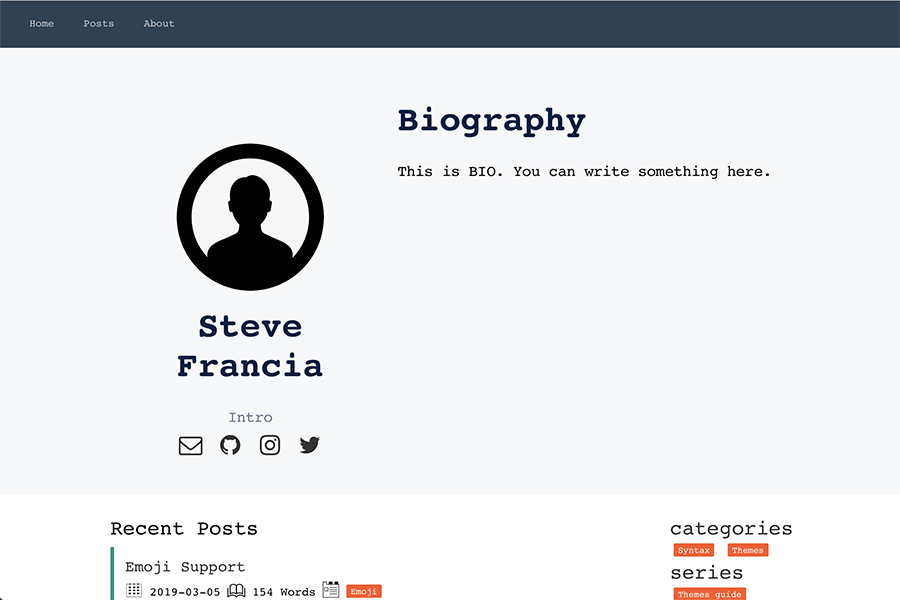
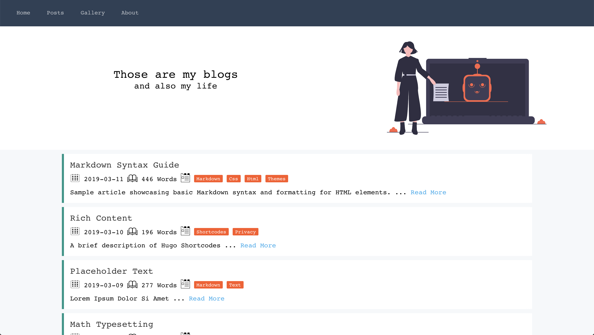
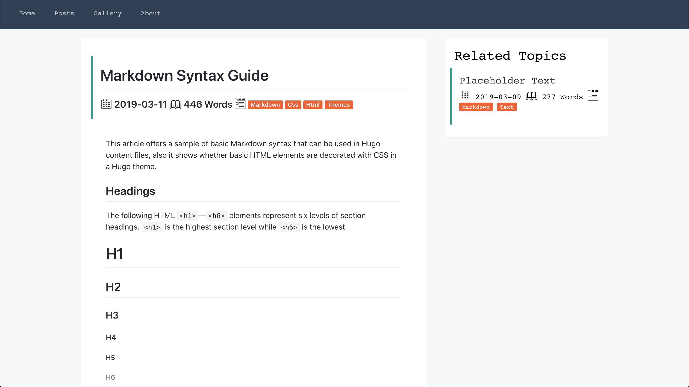

# Erblog

A personal blog theme powered by [Hugo](https://gohugo.io).
Erblog is written by Ertuil with [layui.js](https://www.layui.com), [font-awssome](https://fontawesome.com),github markdown css  and [undraw](https://undraw.co).

Erblog is also a responsive theme which means it is customed for your mobile platforms.







## 1. Installation

You can install the theme by git clone.

```
$ git submodule add https://github.com/ertuil/erblog themes/erblog
$ git submodule init
$ git submodule update
```

Now you can get updates to Erblog in the future by updating the submodule:

```
$ git submodule update --remote themes/minimal
```

## 2. Configuration

There are some basic configuration options you may want to use:

| Name | Description | Default |
| ---- | ---- | ---- |
| title | Name of your website | None |
| googleAnalytics | Google Analytics ID| None |
| Params.portrait | The protrait file | erblog/static/self/img/avater.jpg |
| Params.author | Your Name | 'Authors' |
| Params.description | A simple description | 'Intro' |
| Params.bio | Your biological description | None |
| Params.favicon | The favicon file | "/favicon.ico" |

Alse you can add your own custom menus in `config.toml` like this:

```
[[menu.main]]
    url = "/home/"
    name = "Files"
    weight = 6

[[menu.main]]
    url = "/dl/"
    name = "Download"
    weight = 7
```

A Menu in the footer is also available:

```
[[menu.footer]]
    identifier = "home"
    name = "home"
    url = "/"
    weight = 1

[[menu.footer]]
    identifier = "about"
    name = "About"
    url = "/about/"
    weight = 2
```

Now you can add your contacts like this:

```
# Social icons to be shown on the right-hand side of the navigation bar
# The "name" field should match the name of the icon to be used
# The list of available icons can be found at http://fontawesome.io/icons/

[[menu.icon]]
    url = "mailto:me@xxx.com"
    name = "envelope-o"
    weight = 1

[[menu.icon]]
    url = "https://github.com/username/"
    name = "github"
    weight = 1

[[menu.icon]]
    url = "https://twitter.com/username"
    name = "twitter"
    weight = 1

[[menu.icon]]
    url = "https://www.instagram.com/username/"
    name = "instagram"
    weight = 1
```

For more details, see exampleSite.

## 3. Content Management

### 3.1 Posts

There are three basic sections, 'post', 'zone' and 'gallery'. You may create a new post using the following command:

```
hugo new post/post_name.md
```

### 3.2 Zone

A section like facebook


```
hugo new zone/example.md
```

### 3.3 Gallery

Gallery is a simple collection for your photos.


```
hugo new gallery/gallery_name.md
```

You can upload your files to `/static` directory and write these contents in `gallery_name.md`:

```
---
title: "A gallery"
date: 2019-12-01T13:21:53+08:00
draft: false
---


```

### 3.4 Add zone and gallery to menu

Add the following content to your `config.toml`

```toml
[[menu.main]]
    url = "/zone/"
    name = "Zone"
    weight = 1

[[menu.main]]
    url = "/gallery/"
    name = "Gallery"
    weight = 2
```